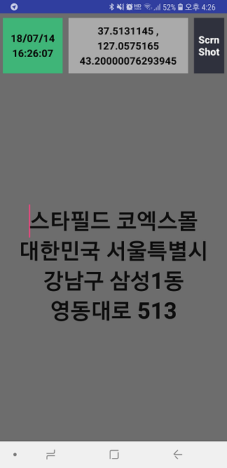

# SaveHere

With this application, you can memorize where you were. 

It saves current position into Camera folder as screen shot, so that you may refer the place later.

Information in screen shots are
- google API address in Korean and/or English
- your text input, e.g. place name, shop name,.. to remember
- GPS coordinates ()
- screen shot date and time (local time)

This application is for those who travels around the world and wants to record where he/she was. By capturing you can review photo with screen shot in time sequenced between photos.

## Permission Required

For simplicity, I did not fully implement the following permission process
- WRITE_EXTERNAL_STORAGE (save captured image)
- ACCESS_FINE_LOCATION (get GPS information)

These permission should be applied by manual application setting for now.
Later I'll add permission process.

## Source in github

Application source can be downlowed from [my github][1].

[1]: https://github.com/riopapa/SaveHere

## Android Version

- Android SDK API 25 (Nuguar 7.1.1) or above 
=======
## Pre Requirement

- Android SDK API 25 or above
>>>>>>> origin/master

## Screenshots

## Functionality

When you run this program, it shows google map and nearby place list.

You may select one from the list or press cancel button.

If you selected the place name, it will be shown in screen with address of it google maps API has given.

Or if you have pressed cancel button, address given by google GPS info will be shown in screen with blank first line. And then you may enter place name as you want to.

GPS information and Date/time information also will be displayed on thop.

By pressing [Scrn Shot], information will be saved into DCIM folder in landscape mode.

## Comments

- This is my first application in android studio.
- Thanks to [google sample in github][2] for screen shot

[2]: https://github.com/googlesamples/android-ScreenCapture

