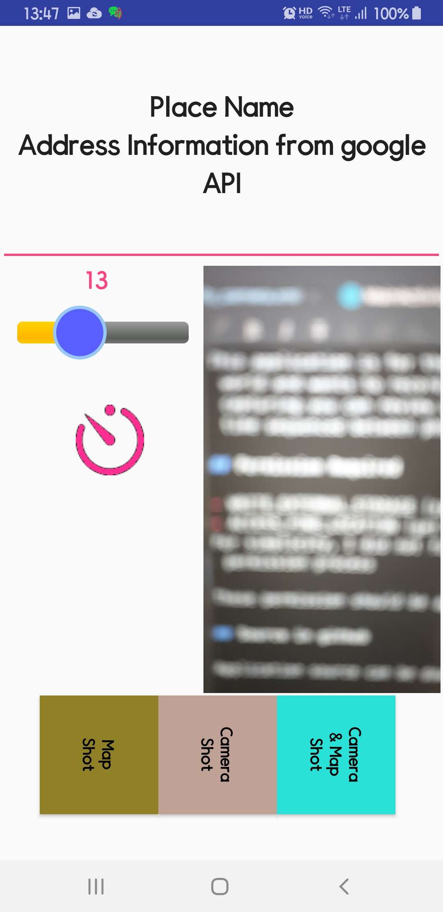

# SaveHere

With this application, you can memorize where you were. 

It saves current position into Camera folder as screen shot, so that you may refer the place later.

Information in screen shots are
- google map place and address or your text input, e.g. place name, shop name,.. to remember
- GPS coordinates ()
- screen shot date and time (local time)

This application is for those who travels around the world and wants to record where he/she was. By capturing you can review photo with screen shot in time sequenced between photos.

## Permission Required

- WRITE_EXTERNAL_STORAGE (save captured image)
- ACCESS_FINE_LOCATION (get GPS information)
For simplicity, I did not fully implement the following permission process

These permission should be applied by yourself.

## Source in github

Application source can be downloaded from [my github][1].

[1]: https://github.com/riopapa/SaveHere

## Screenshots

  mainActivity.xml
   
  Photo shot with location information File name in DCIM has place name also
  
  Google Map shot with location information File name in DCIM has place name also

## How to use

1. Run this program, and it shows google map and nearby place list.

2. You may select one from the list or press cancel button to input place name by yourself.

If you selected the place name, it will be shown in screen with address of it google maps API has given.

Or if you have pressed cancel button, address given by google GPS info will be shown in screen with blank first line. And then you may enter place name as you want to.

You have three options

- Camera and Map shot : Create photo and map
- Camera shot : Create photo
- Map shot : Create map

### Optional functions

- slide bar : to adjust google map scale (higher value is more zoomed-in), scale will be saved for next use
- Timer : if clicked, screen show will be activated after 10 secs when you click Camera button

## Comments

- Android SDK API 25 (Nuguar 7.1.1) or above 
- Thanks to [google sample in github][2] for screen shot

[2]: https://github.com/googlesamples/android-ScreenCapture

